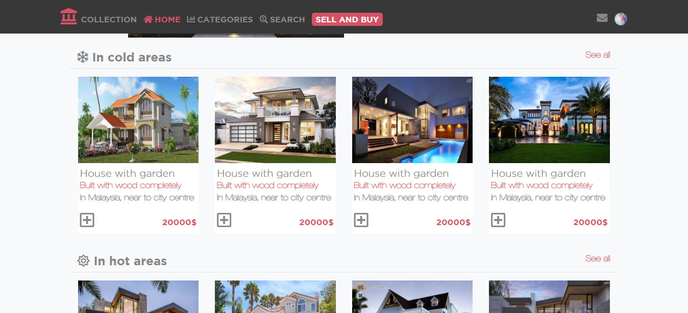
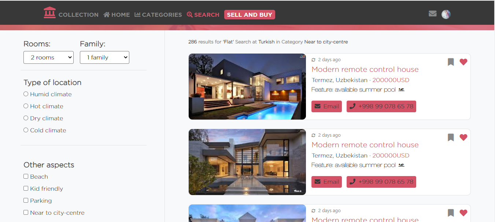
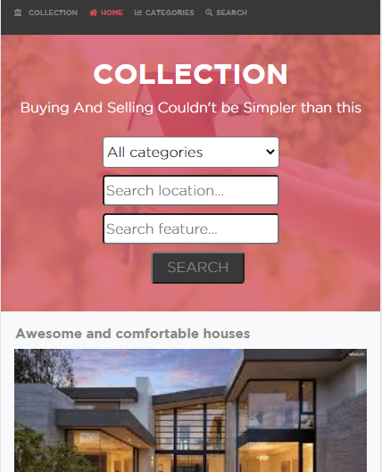
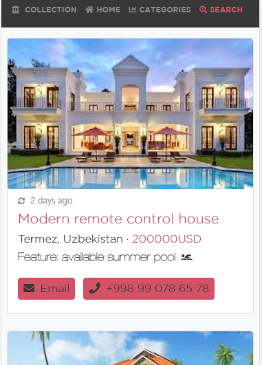

# house-selling-website

This project has 2 pages, namely: home page and search page. It is completely responsive and targets 2 breakpoints. This project also utilizes utility classes heavily such as `mt-3`, `flex`, instead of specific classes like `navigation`, `accordion` etc, for their reusability purposes.

All the `.css` file has been segmentized into directories depending on their `action`. For example: `pink` and `pink-background` classes go inside the `colors` directory and more generic classes such as the `gotham` go inside the `Fonts` directory. The componentization method has been adopted to avoid specificity issues and for ease of `import`ing the files.

### Home page layout

### Search page layout

## On Phone mode

 

## Built With

## Live Demo

[Live demo link]( https://abdumurodovazulfizar.github.io/house-selling-website/)

## Getting Started

To get a local copy up and running follow these simple steps.

- `git clone https://github.com/AbdumurodovaZulfizar/house-selling-website.git`
- `cd house-selling-website`
- `git checkout -b project-branch`
- `git pull origin project-branch`
- If you have vscode `live-server` installed, run it and open `localhost:3000`

## Authors

👩🏻‍💼 **Author1**

- GitHub: [@AbdumurodovaZulfizar](https://github.com/AbdumurodovaZulfizar)
- Twitter: [@Zulfizar](https://twitter.com/Zulfiza70357085)
- LinkedIn: [Zulfizar Abdumurodova](https://www.linkedin.com/in/zulfizar-abdumurodova-a61527206/)

## 🤝 Contributing

Contributions, issues, and feature requests are welcome!

## Show your support

Give a ⭐️ if you like this project!

## Acknowledgments

- [MurodjonTursunpolatov](https://github.com/Murodjon000) for the project guidelines.
- [Microverse](https://www.microverse.org/) for international opportunities.
- [Fontaawesome](https://fontawesome.com/) for their well-designed icons.
- [Font Family](https://freefontsfamily.com/) for beatiful fonts.
- [Shutterstock](https://www.shutterstock.com/search/residential) for their beautiful images.
- [Microverse](https://www.microverse.org/) for their `README` [template](https://github.com/microverseinc/readme-template).

## 📝 License

Copyright 2021 Zulfizar Abdumurodova

Permission is hereby granted, free of charge, to any person obtaining a copy of this software and associated documentation files (the "Software"), to deal in the Software without restriction, including without limitation the rights to use, copy, modify, merge, publish, distribute, sublicense, and/or sell copies of the Software, and to permit persons to whom the Software is furnished to do so, subject to the following conditions:

The above copyright notice and this permission notice shall be included in all copies or substantial portions of the Software.

THE SOFTWARE IS PROVIDED "AS IS", WITHOUT WARRANTY OF ANY KIND, EXPRESS OR IMPLIED, INCLUDING BUT NOT LIMITED TO THE WARRANTIES OF MERCHANTABILITY, FITNESS FOR A PARTICULAR PURPOSE AND NONINFRINGEMENT. IN NO EVENT SHALL THE AUTHORS OR COPYRIGHT HOLDERS BE LIABLE FOR ANY CLAIM, DAMAGES OR OTHER LIABILITY, WHETHER IN AN ACTION OF CONTRACT, TORT OR OTHERWISE, ARISING FROM, OUT OF OR IN CONNECTION WITH THE SOFTWARE OR THE USE OR OTHER DEALINGS IN THE SOFTWARE.
